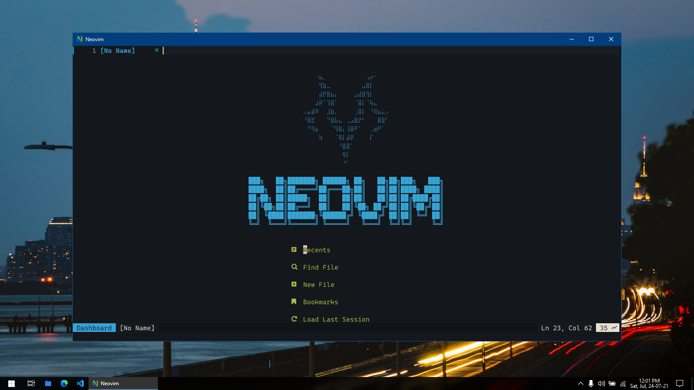
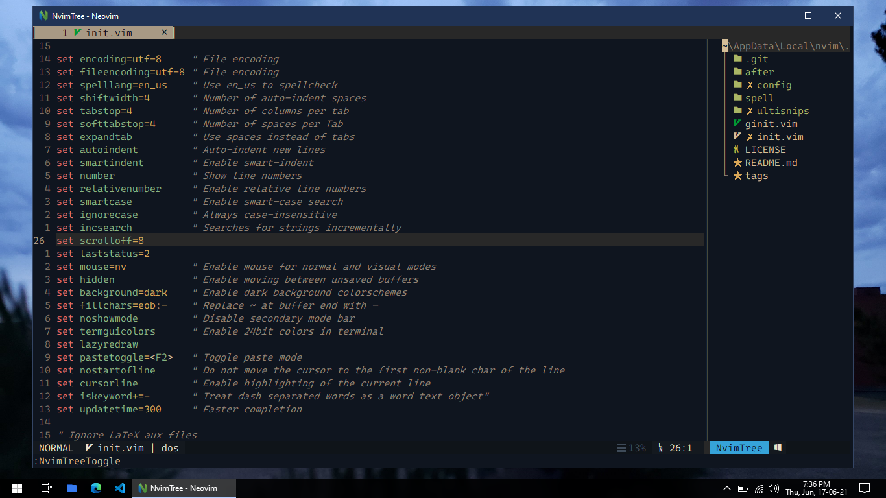
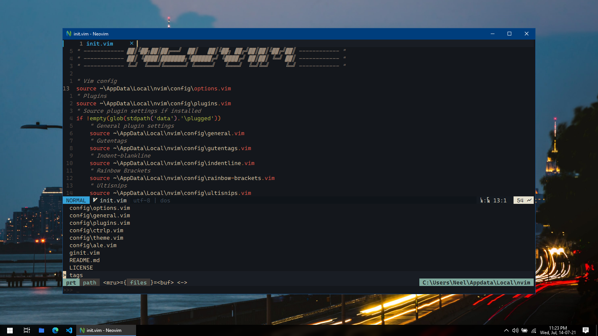
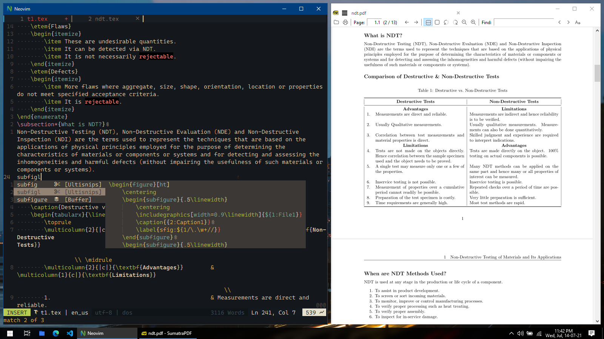
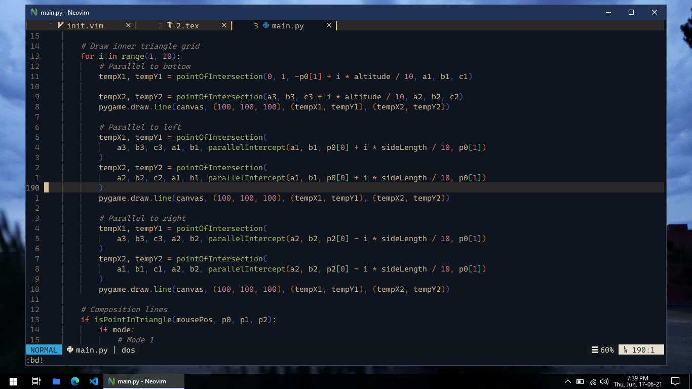
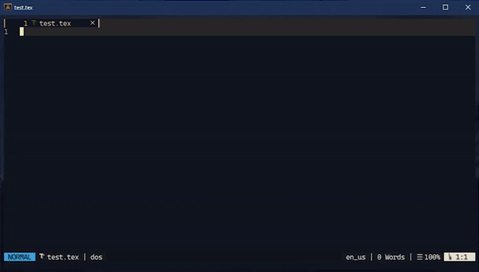

Just another visually appealing Neovim IDE. Currently supports LaTeX and Python.

# Screenshots 📷

> Using [Neovim-qt](https://github.com/equalsraf/neovim-qt) + [Gruvbox Material](https://github.com/sainnhe/gruvbox-material) + [Cascadia Code NF](https://www.nerdfonts.com/font-downloads)







> Snippet and Completion Preview



---

# Installation ⚡

The following instructions are for Windows (powershell).

1. Install chocolatey

    ```powershell
    Set-ExecutionPolicy Bypass -Scope Process -Force; [System.Net.ServicePointManager]::SecurityProtocol = [System.Net.ServicePointManager]::SecurityProtocol -bor 3072; iex ((New-Object System.Net.WebClient).DownloadString('https://chocolatey.org/install.ps1'))
    ```

2. Install dependencies

    ```
    choco install neovim --pre
    choco install git python universal-ctags sumatrapdf miktex which
    ```

3. Configure python

    ```
    py -m pip install pynvim flake8 black jedi
    ```

4. Clone repo and open nvim-qt or nvim

    ```
    git clone https://github.com/Neelfrost/dotfiles.git $HOME\Appdata\Local\nvim
    ```

---

# Features 📃

General

-   Persistent cursor positions when switching buffers
-   Ability to add custom directories to startify
-   Resume cursor position when re-opening a file
-   Auto update file if changed outside of neovim

LaTeX

-   Extensive snippets for LaTeX
-   Start newline with \item (or \task) if inside a list environment when pressing <kbd>Enter</kbd>, <kbd>o</kbd> or <kbd>O</kbd>

## Plugins Used

-   Buffer navigation: [barbar.nvim](https://github.com/romgrk/barbar.nvim)
-   Minimal and extensible statusline: [lightline.vim](https://github.com/itchyny/lightline.vim)
-   Start screen: [vim-startify](https://github.com/mhinz/vim-startify)
-   File navigation: [nvim-tree.lua](https://github.com/kyazdani42/nvim-tree.lua)
-   Fuzzy file search: [ctrlp.vim](https://github.com/ctrlpvim/ctrlp.vim)
-   Icons for NvimTree, Startify, bufferline/statusline: [nvim-web-devicons](https://github.com/kyazdani42/nvim-web-devicons), [vim-devicons](https://github.com/ryanoasis/vim-devicons)
-   Syntax highlighting: [vim-polyglot](https://github.com/sheerun/vim-polyglot)
-   Async completion: [deoplete.nvim](https://github.com/Shougo/deoplete.nvim)
-   Syntax checking and formatting: [ale](https://github.com/dense-analysis/ale), [vim-autoformat](https://github.com/vim-autoformat/vim-autoformat)
-   Indent lines: [indent-blankline.nvim](https://github.com/lukas-reineke/indent-blankline.nvim)
-   Auto pair brackets: [auto-pairs](https://github.com/jiangmiao/auto-pairs)
-   Colored matching brackets: [rainbow](https://github.com/luochen1990/rainbow)
-   Highlight yank: [vim-highlightedyank](https://github.com/machakann/vim-highlightedyank)
-   Display color: [nvim-colorizer.lua](https://github.com/norcalli/nvim-colorizer.lua)
-   Python formatter: [black](https://github.com/psf/black)
-   Python support: [deoplete-jedi](https://github.com/zchee/deoplete-jedi), [jedi-vim](https://github.com/davidhalter/jedi-vim)
-   LaTeX support: [vimtex](https://github.com/lervag/vimtex)
-   Run commands asynchronously: [asyncrun.vim](https://github.com/skywind3000/asyncrun.vim), [asyncrun.extra](https://github.com/skywind3000/asyncrun.extra)
-   Snippet engine: [ultisnips](https://github.com/SirVer/ultisnips)
-   Snippet collection: [vim-snippets](https://github.com/honza/vim-snippets)
-   Commenting: [vim-commentary](https://github.com/tpope/vim-commentary)
-   Faster motion: [vim-easymotion](https://github.com/easymotion/vim-easymotion)
-   Tag management: [vim-gutentags](https://github.com/ludovicchabant/vim-gutentags)
-   Repeat actions: [vim-repeat](https://github.com/tpope/vim-repeat)
-   Bracket Operations: [vim-surround](https://github.com/tpope/vim-surround)
-   TitleCase: [vim-titlecase](https://github.com/christoomey/vim-titlecase)
-   Better quickfix: [nvim-bqf](https://github.com/kevinhwang91/nvim-bqf)
-   Aligning: [vim-easy-align](https://github.com/junegunn/vim-easy-align)
-   Spelling errors in quickfix list: [vim-SpellCheck](https://github.com/inkarkat/vim-SpellCheck), [vim-ingo-library](https://github.com/inkarkat/vim-ingo-library)

<!-- ## Keybinds -->

---

# Todo 🕒

-   [x] Automatic plugin install
-   [ ] One-click install script
-   [x] Clear contrast between active and inactive tabs
-   [ ] Add keybinds list
-   [ ] Add snippet list
-   [ ] Add C# Support
